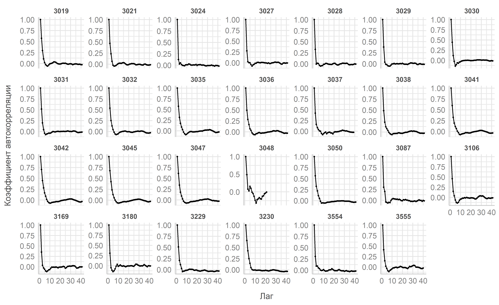
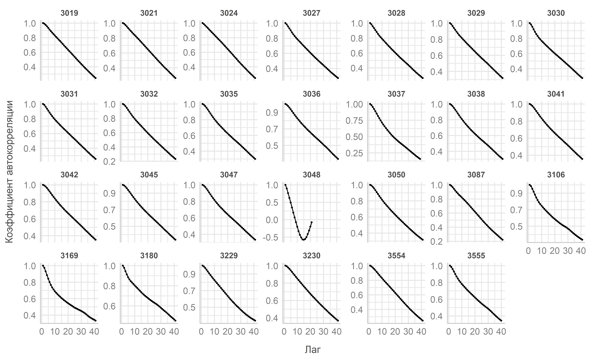
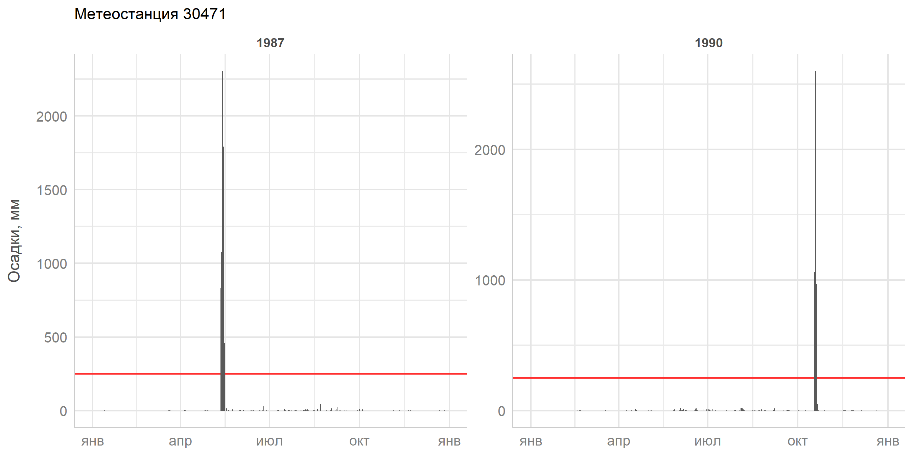

```{r setup, include=FALSE}
options(htmltools.dir.version = FALSE)
knitr::opts_chunk$set(
  fig.width=9, fig.height=3.5, fig.retina=3,
  out.width = "100%",
  cache = FALSE,
  echo = FALSE,
  message = FALSE, 
  warning = FALSE,
  fig.show = TRUE,
  hiline = TRUE
)
```

```{r xaringan-themer, include=FALSE, warning=FALSE}
library(xaringanthemer)
library(xaringanExtra)
use_xaringan_extra(c("tile_view", "panelset"))
style_duo_accent(
  header_font_google = google_font("IBM Plex Serif"),
  text_font_google   = google_font("IBM Plex Sans"),
  code_font_google   = google_font("Fira Mono"),
  primary_color =  "#E59400",#"#1381B0",
  secondary_color = "#006400", #"#FF961C",
  inverse_header_color = "#FFFFFF",
  text_font_size = "13pt",
  header_h3_font_size = "24pt",
  title_slide_background_image = "figs/bg.jpg",
  footnote_font_size = '0.75em',
  footnote_position_bottom = "30px",
  extra_css = list(
    ".pull-left-70" = list("float" = "left", "width" = "65.8%"),
    ".pull-right-30" = list("float" = "right", "width" = "28.2%"),
    ".pull-left-35" = list("float" = "left", "width" = "32.9%"),
    ".pull-right-65" = list("float" = "right", "width" = "61.1%"),
    ".my-footer" = list(
        "position" = "absolute",
        "bottom" = "3px",
        "left" = "0px",
        "height" = "33px",
        "width" = "100%"
      )
  )
)
```

<div class="my-footer" ><span>&emsp;<a href="https://emergencydatahack.ru/"></a>
&emsp;&emsp;&emsp;&emsp;&emsp;&emsp;&emsp;&emsp;&emsp;&emsp;&emsp;&emsp;&emsp;
&emsp;&emsp;&emsp;&emsp;&emsp;&emsp;&emsp;&emsp;&emsp;&emsp;&emsp;&emsp;&emsp;
</span></div> 

### Объект исследования - р. Лена

.pull-left-35[
#### Описание задачи

- Построить предиктивную модель, которая позволит в весенний период на реке Лена оценивать суточное приращение максимального уровня воды на горизонте прогноза семь дней → `delta_stage_max`

- на гидропостах около населенных пунктов
  - Киренск 3019
  - Витим 3027
  - Пеледуй 3028
  - Крестовское 3029
  - Ленск 3030
  - Олекминск 3035
  - Покровск 3041
  - Якутск 3045
  - Сангары 3050
  - Батамай 3230
]

```{r, include = F}
library(tidyverse)
library(sf)
library(tmap)
library(rmapshaper)
library(kableExtra)

theme_set(see::theme_lucid() +
            theme(strip.background = element_blank()))

major_stations <- c(3019,
                    3027:3030,
                    3035,
                    3041,
                    3045,
                    3050,
                    3230)

tmap_mode("view")
tmap_options(
  basemaps = c(
    "CartoDB.Voyager" = "CartoDB.Voyager",
    "Stamen" = "Stamen.Terrain",
    "OSM" = "OpenStreetMap", 
    "ESRI Imagery" = "Esri.WorldImagery"
  )
)

hydro <- read_csv("data/spatial/hydro_coord.csv") %>% 
  st_as_sf(coords = c("lon", "lat"),
           crs = 4326) %>% 
  mutate(station_id = parse_number(station_id)) %>% 
  mutate(type = ifelse(station_id %in% major_stations,
                       "Основные", "Дополнительные")) %>% 
  mutate(type = as.factor(type)) %>% 
  mutate(type = fct_rev(type)) %>% 
  mutate(river = str_split(name, " - ", simplify = T)[,2],
            post = str_split(name, " - ", simplify = T)[,1])

ws <- st_read("data/spatial/hydro_ws_joined.shp") %>% 
  ms_simplify(keep = .2)

```

.pull-right-65[
```{r, out.height = 500, out.width = 650}
tm_shape(ws,
         name = "Водосборы") +
  tm_borders(col = "black",
             lwd = 2) +
  tm_shape(hydro,
           "Гидропосты") +
  tm_dots(
    title = "Гидропосты",
    col = "type",
    palette = c("red", "blue"),
    popup.vars=c("Река"="river",
                 "Пост"="post",
                 "Площадь, км^2"="drainage_area")
  ) +
  tm_scale_bar() +
  tm_mouse_coordinates()
```
]

---
<div class="my-footer" ><span>&emsp;<a href="https://emergencydatahack.ru/"></a>
&emsp;&emsp;&emsp;&emsp;&emsp;&emsp;&emsp;&emsp;&emsp;&emsp;&emsp;&emsp;&emsp;
&emsp;&emsp;&emsp;&emsp;&emsp;&emsp;&emsp;&emsp;&emsp;&emsp;&emsp;&emsp;&emsp;
</span></div> 


### Выбор таргета

Из-за высоких коээфициентов автокорреляции таргетом была выбрана переменная `stage_max`, а не `delta_stage_max`.
.panelset[
.panel[.panel-name[delta_stage_max]
<center></center>
]
.panel[.panel-name[stage_max]
<center></center>
]
]

---
<div class="my-footer" ><span>&emsp;<a href="https://emergencydatahack.ru/"></a>
&emsp;&emsp;&emsp;&emsp;&emsp;&emsp;&emsp;&emsp;&emsp;&emsp;&emsp;&emsp;&emsp;
&emsp;&emsp;&emsp;&emsp;&emsp;&emsp;&emsp;&emsp;&emsp;&emsp;&emsp;&emsp;&emsp;
</span></div>

### Выбор предикторов

.panelset[
.panel[.panel-name[Метео]

.pull-left[


]

.pull-right[
- 3-х часовые набюлдения по осадкам `meteo_3hours.csv` аггрегированы до суточных величин. Выбраны осадки `prec` и среднесуточная температура воздуха `temp`. 

- Осадки отфильтрованы согласно рекомендациям ФГБУ «ВНИИГМИ-МЦД» по допустимым значениям для метеорологических параметров для данного региона [(Таблица 2)](http://meteo.ru/data/163-basic-parameters#%D0%BE%D0%BF%D0%B8%D1%81%D0%B0%D0%BD%D0%B8%D0%B5-%D0%BC%D0%B0%D1%81%D1%81%D0%B8%D0%B2%D0%B0-%D0%B4%D0%B0%D0%BD%D0%BD%D1%8B%D1%85). Для используемых метеостанций не более 250 мм осадков между сроками.

]
]

.panel[.panel-name[Гидро]
.pull-left[

- В качестве гидрологических предикторов был использован максимальные суточные уровни воды `stage_max` за предыдущие 10 дней.

]
.pull-right[

]
]
]